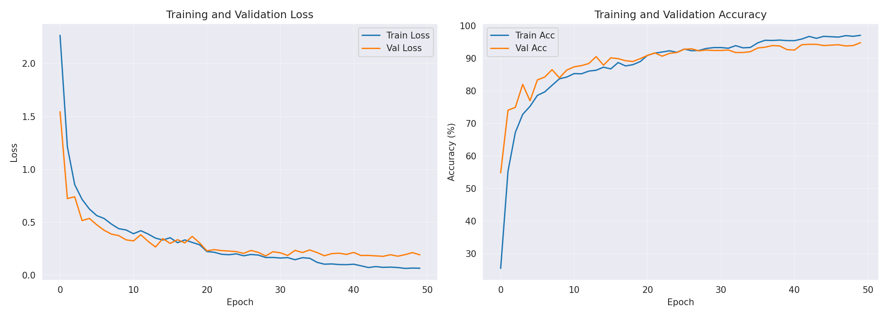
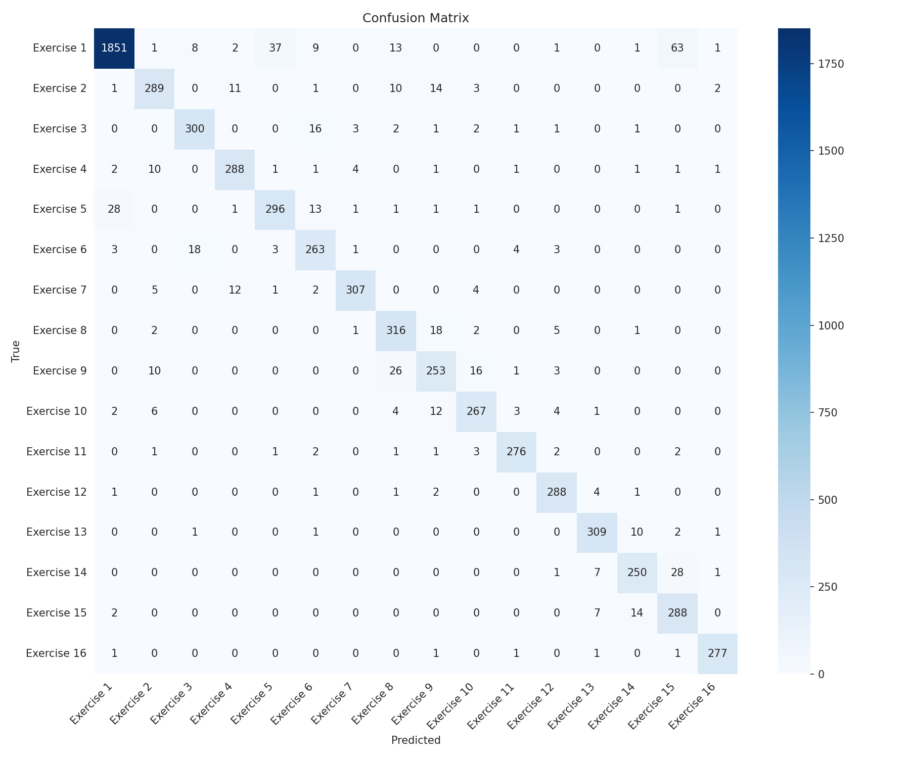
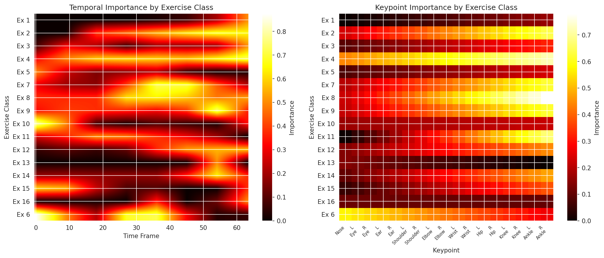

# 3D-Conv-Action-GradCAM

*Course: Computer Vision (Widzenie Komputerowe) · AGH University of Kraków*

Skeleton-based exercise recognition with a 3D CNN, plus Grad-CAM interpretability analysis.
The model classifies 16 exercise types from YOLO-pose skeleton keypoint sequences; Grad-CAM
heatmaps verify that predictions are driven by biomechanically relevant joints and motion
phases rather than spurious correlations.

Final model & weights on [HuggingFace](https://huggingface.co/f4rys/3D-Conv-RB/tree/main).
Full analysis (Polish): [reports/raport_widzenie.pdf](reports/raport_widzenie.pdf)

## Method

- **Data**: YOLO-pose keypoints (17 joints, x/y/z) extracted per video frame; 64-frame sliding
  windows with stride 32; per-window labels by majority vote; class-weighted loss for the
  imbalanced class distribution.
- **Model** (`src/action3d/model.py`): 2D convolutions over the (time x keypoint) plane with
  coordinate channels - three conv blocks ([32, 64, 128] channels, BatchNorm, max-pool) and a
  three-layer MLP head. An optional velocity channel mode (`SkeletonDataset(channel_mode="velocity")`)
  replaces raw coordinates with frame-to-frame finite differences.
- **Training**: Adam + ReduceLROnPlateau, early stopping on validation accuracy, 50 epochs max.
- **Interpretability**: Grad-CAM on the last conv block, mapped back to (time x keypoint) space
  and overlaid on the original video frames.

## Results

Validation accuracy stabilizes around ~94.8% after epoch 40-50; the held-out test accuracy stored
in the released checkpoint is 91.74%. The confusion matrix shows most residual confusion between
biomechanically similar exercises.





Grad-CAM analysis (details in the report, in Polish):

- Activation concentrates on the joints actually loaded in each exercise (e.g. elbows and
  shoulders for upper-body exercises), ignoring static or irrelevant keypoints.
- Attention intensity shifts with the motion phases of largest acceleration, indicating the
  network uses movement dynamics, not just static body posture.
- Activation regions coincide with limb motion rather than background, supporting model
  trustworthiness.



## Repository Layout

```
src/action3d/          Pipeline package
  config.py            Hyperparameters, keypoint names, skeleton graph
  data.py              CSV loading, sliding-window sequences, Dataset, dataloaders
  model.py             Action3DCNN architecture
  train.py             Training/evaluation loops, early stopping
  gradcam.py           Grad-CAM implementation
  visualization.py     Plots and video-frame overlays
  checkpoint.py        Checkpoint save/load
notebooks/             Thin orchestration notebooks (training, video Grad-CAM, data exploration)
model/                 Trained checkpoint (action_3dcnn_model.pth)
images_to_report/      Figures used in the report
reports/               Project report (PDF, Polish)
```

## Setup

```bash
uv sync
```

## Usage

The notebooks require the private Resistive Band dataset under `data/` (skeleton CSVs, labels,
split.csv, anonymized videos) - not included in this repository. The trained checkpoint in
`model/` and the figures in `images_to_report/` were produced from it.

- `notebooks/training.ipynb` - end-to-end training, evaluation and per-class Grad-CAM
- `notebooks/gradcam_video.ipynb` - Grad-CAM overlays on original video frames
- `notebooks/explore_data.ipynb` - dataset exploration

Package use without notebooks:

```python
from action3d import Action3DCNN, GradCAM, load_checkpoint

model, checkpoint = load_checkpoint("model/action_3dcnn_model.pth", device="cpu")
```

## Authors

- Wojciech Bartoszek
- Łukasz Checiak
- Jarosław Kołdun
- Mateusz Oracz
